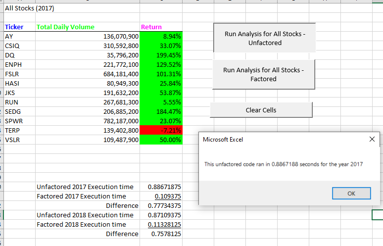
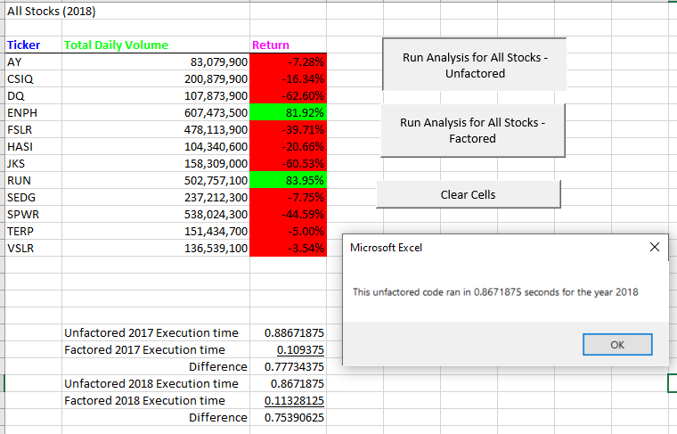
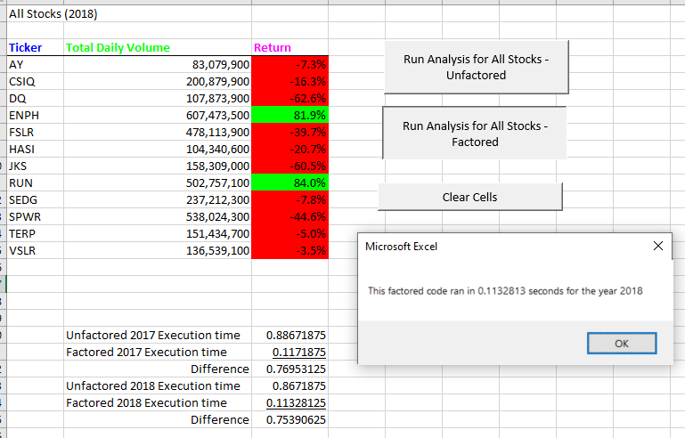

# Module 2 Challenge - Refactored Code Analysis

## Overview of Project
Using Excel, VBA code was used to develop a routine to calculate the Total Daily Volume and Return on Investment (ROI) percentage for each of the 12 stocks provided. Upon completion, the data is summarized, formatted, and color coded for display. In addition to correctly automating the calculation, there is a need to expedite the execution of this code. The VBA code was refactored and execution times were collected and a comparative analysis is provided in this report.

## Results
### Unfactored 2017 Stock Analysis Results and Execution Time

### Factored 2017 Stock Analysis Results and Execution Time

### Unfactored 2018 Stock Analysis Results and Execution Time

### Factored 2018 Stock Analysis Results and Execution Time

## Summary
Below is a summary of the VBA code execution times for Unfactored vs. Factored for both years 2017 and 2018. Notice that the Factored code runs in half the time as the previous unfactored code. 

Refactoring code is the process of reviewing previously developed code into more efficient, and possibly more robust code. The result is typically faster runtimes, and code that is easily able to handle many more or all types of incoming data conditions. A developer is able to review with fresh eyes and see different perspectives to constructor or deconstruct the code into more efficient processes. For this project, the refactored code was faster, but it removed verification conditional statement that could lead to erroneous data.

One of the major differences between the two codes is the choice as to when to update the "All Stocks Analysis" sheet. In the previous unfactored code, the "All Stocks Analysis" sheet is activated 12 times in order to update the ticker, total volume and return %. In the factored code, this section has been pulled out until all the data has been collected into new arrays. The activation of the "All Stocks Analysis" sheet is only activated once. 

Another difference is removing the need to have an If Conditional statement asking whether the ticker matches prior to updating the TickerVolume. Since the initialization of the array is known to be sorted in the same manner as the data, it is safe to assume the first stock record to be analyzed matches the first element in the tickers array. Based on industry standards, this is not recommended unless the array data is pupulated dynamically based of of the distinct ticker symbols within the stock dataset. It is not safe to assume anything. If the ticker symbol in the spreadsheet changed, then the data would be mismatched and incorrect.

